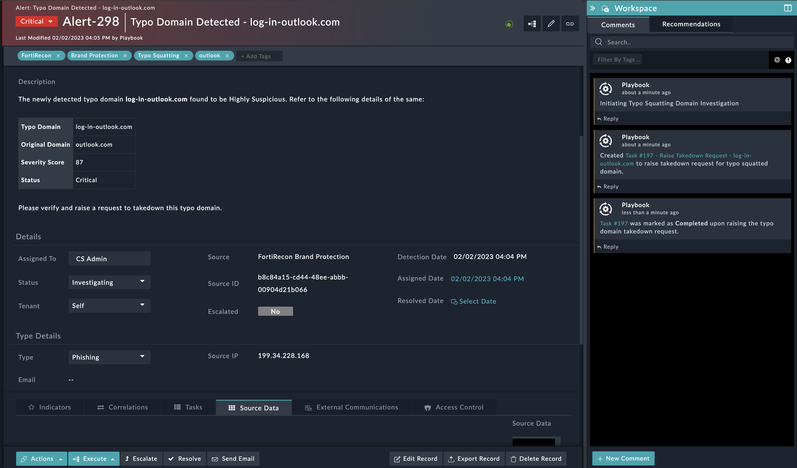
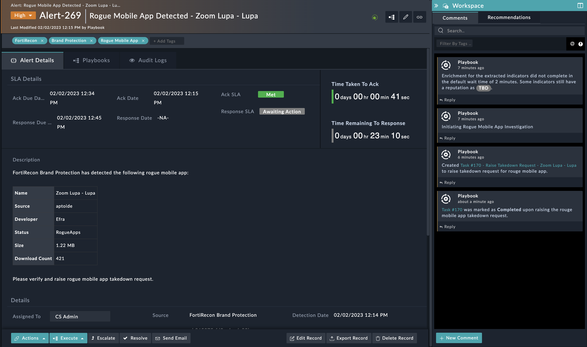

| [Home](../README.md) |
|----------------------|

# Usage

Refer to [Simulate Scenario documentation](https://github.com/fortinet-fortisoar/solution-pack-soc-simulator/blob/develop/docs/usage.md) to understand how to simulate and reset scenarios.

To understand the process FortiSOAR follows to respond to alerts related to typo squatted domains and rogue mobile apps, we have included two scenarios &mdash; **Typo Squatting Domain Detected** and **Rogue Mobile App Detected** &mdash; with this solution pack.

## Typo Squatting Domain Detected

This scenario generates an example alert of Type *Phishing* in FortiSOAR's **Alerts** module.

Navigate to the demo alert and note the following:

- The demo alert created is an example of FortiRecon Brand Protection detecting a typo domain that is *Highly Suspicious*
- The alert is of type *Phishing*
- The reported alert contains the following information:
    - Typo Domain Details:
        - Typo Domain
        - Original Domain
        - Severity Score
        - Status
    - Source
    - Source ID
    - Source IP
    - Indicators are created for typo domain and Source IP Address

- The response playbook `High Risk Typo Domain Response` runs automatically when all the indicators are extracted and enriched
    - This playbook creates a manual task of type *Takedown Request* to raise takedown request for high risk typo domain
    - Once a typo domain takedown request is raised, the user should mark the task as *Completed*

    

## Rogue Mobile App Detected

This scenario generates an example alert of Type *Phishing* in FortiSOAR's **Alerts** module.

Navigate to demo alert and note the following:

- The demo alert created is an example of FortiRecon Brand Protection detecting a *Rogue Mobile App*
- The alert is of type *Phishing*
- The reported alert contains the following information:
    - Rogue Mobile App Details:
        - Name
        - Source
        - Developer
        - Status
        - Size
        - Download Count
    - Source
    - Source ID

- The response playbook `High Risk Rogue Mobile App Response` runs automatically when all the indicators are extracted and enriched
    - This playbook creates a manual task of type *Takedown Request* to raise takedown request for high risk rogue mobile app
    - Once a rogue mobile app takedown request is raised, the user should mark the task as *Completed*

    

| [Installation](./docs/setup.md#installation) | [Configuration](./docs/setup.md#configuration) | [Contents](./docs/contents.md) |
|--------------------------------------------|----------------------------------------------|------------------------|